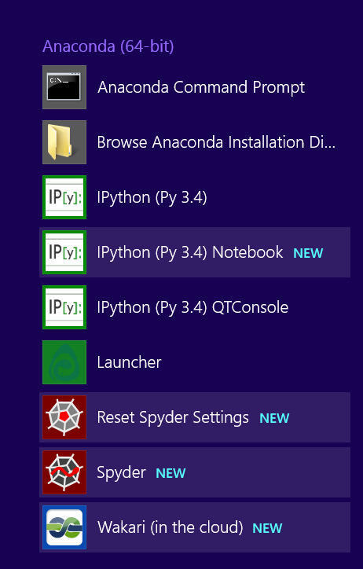
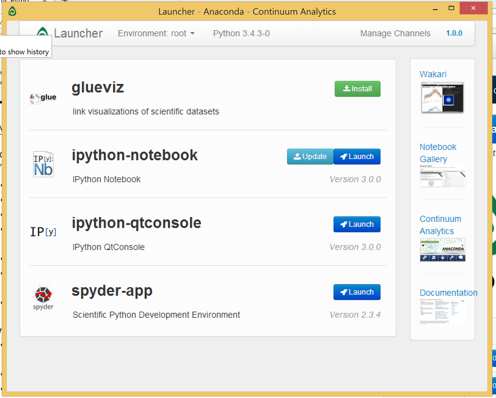

# Quick start your adventure of scientific computing in python

### What is python?

Python is a generic programming language. It largely maintained by the programmers around the world. Apart from the core part of the language, there are huge amounts of packages around so that you can stand on the shoulder of the giants and quickly solve your problem.

For more information, please visit the [official python website](https://www.python.org).

### How can I use python for scientific calculation?

Several python packages are extremely popular and useful for scitific calculation.
- Numpy : a package for vector/matrix manipulations and common linear algebra operations
- Scipy : a package many routine scientific calculation, such as least mean square fittings, signal processing, etc. 
- Matplotlib: a package for 2D and 3D plots
More information of these packages can be found in their official websites.

[Showcases](https://www.python.org/about/success/#scientific) shows what you can do with python in scientific research.

### Where can I download?

Although you can download the python language itself and the packages one by one from each website, but it's a very lengthy and tiresome work for beginners. 

Fortunately, the company [continuum](http://continuum.io) does this job for you. They collect the most popular python packages along with the python core languages into one package, so you can just download it and go! What's the most important is IT'S FREE!

You can download this distribution via the following link:

http://continuum.io/downloads#py34

I recommend you select the version of python 3.4.

### I downloaded and installed Anaconda, where should I start?

There are many applications installed with Anaconda distribution. For an easy start, you can select Launcher in you Apps menu:

After that you should see a launch screen like this:

For more instructuctions on how to use these software, I suggest you click on Notebook Gallery on the panel to view or download some examples.

Alternatively, you can press "Launch" of ipython notebook to play with.

